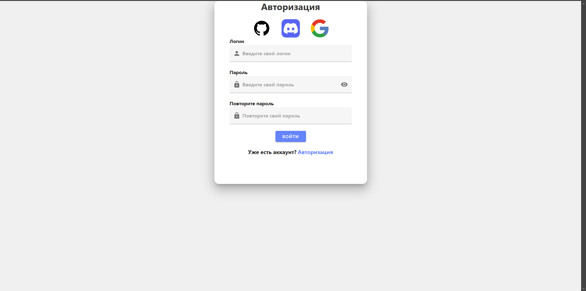
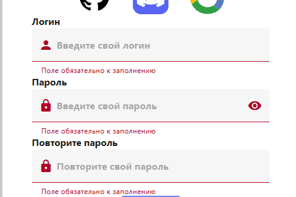

# Vue auth

Сидел и хотел сделать проект что-то вроде гугл формс, потом что-то бросил и остановился лишь на авторизации  
Ибо я чутка неумеха, то это максимум пока что по UI и логике

## Backend Stack

<ol>
    <li>Nestjs</li>
    <li>Prisma</li>
    <li>Postgres</li>
</ol>

## Frontend Stack

<ol>
    <li>Vue</li>
    <li>Pinia</li>
    <li>File routing</li>
    <li>Vuetify</li>
</ol>

## Что нового я узнал?

Познакомился больше с vuetify как с ui фреймворком

## Скришнотики

